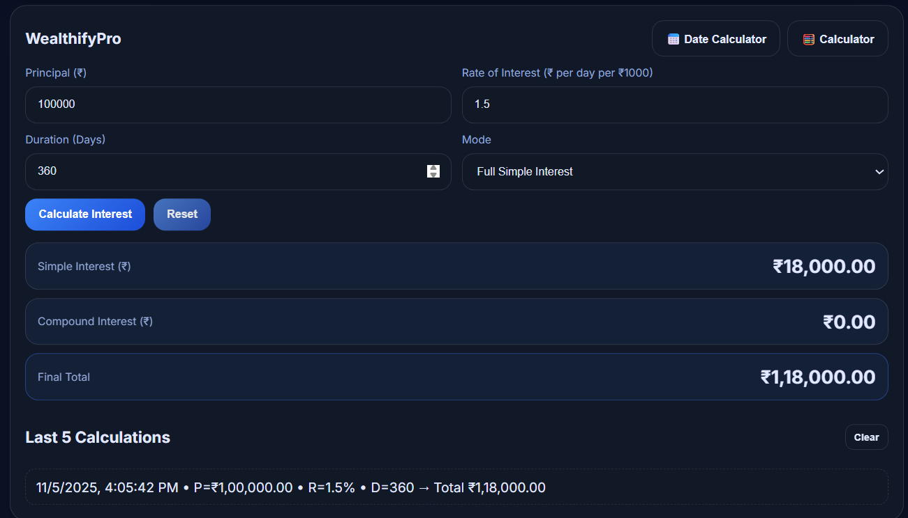
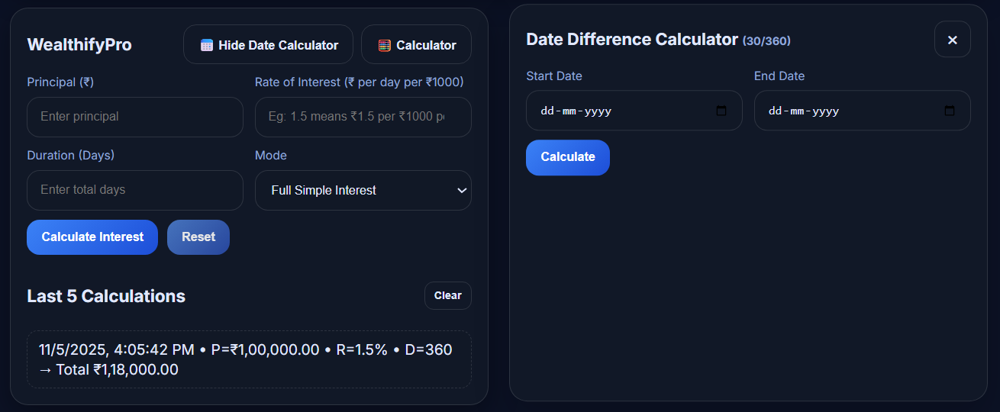
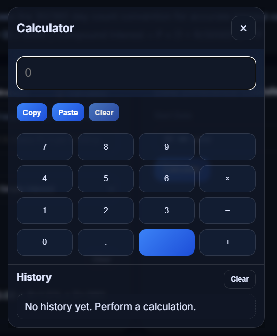

# 💰 WealthifyPro

**WealthifyPro** is a modern web-based financial calculator built with **HTML, CSS, and JavaScript**.  
It helps you compute **Simple Interest**, **Compound Interest**, and **Date Differences** using the **30/360 day-count convention**, with a clean interface and multiple color themes.

---

## 🚀 Features

- 🧮 **Simple & Compound Interest Calculator**
  - Choose between full Simple Interest or hybrid (Simple + Compound) modes.
  - Animated result display with currency formatting.

- 📅 **Date Difference Calculator**
  - Calculates day differences using the 30/360 convention.
  - Automatically fills duration into the interest calculator.

- 🎨 **Theme & Palette Support**
  - 28 color palettes (14 light, 14 dark) with persistent settings.
  - Automatically adjusts between light/dark modes.

- 🪟 **Built-in Popup Calculator**
  - Supports arithmetic expressions, history, copy/paste, and modal-based UI.

- 💾 **Local History**
  - Stores up to 5 recent interest calculations and 10 popup calculator entries.

---

## 🧩 Tech Stack

- **HTML5** — structure and semantic layout  
- **CSS3** — responsive, modern design with theme support  
- **JavaScript (Vanilla)** — logic, storage, animation, and interactivity  
- **LocalStorage API** — to persist user preferences and history  

---

## 🖥️ Preview

Try the live demo:  
👉 [https://wealthifypro.netlify.app/](https://wealthifypro.netlify.app/)

---

## ⚙️ Setup Instructions

1. Clone the repository:
   ```bash
   git clone https://github.com/<your-username>/WealthifyPro.git
   cd WealthifyPro
  
2. Open the `index.html` file in your browser.

No build tools required — **pure HTML, CSS, JS**.

---

## 📂 Project Structure

```
WealthifyPro/
│
├── index.html       # Main interface
├── style.css        # UI and theme styling
├── script.js        # Logic and interactivity
└── favicon.svg      # App icon
```

---

## 📸 Screenshots






---

## 👨‍💻 Author

**MALLIDI SAI SURESH REDDY**
🌐 [Portfolio](https://worksbysuresh.netlify.app/)
💼 Open for collaboration & internships

---

## 🪪 License

This project is licensed under the **MIT License** — feel free to use, modify, and share.

---

> “Precision meets simplicity — calculate smarter with WealthifyPro.”

```
